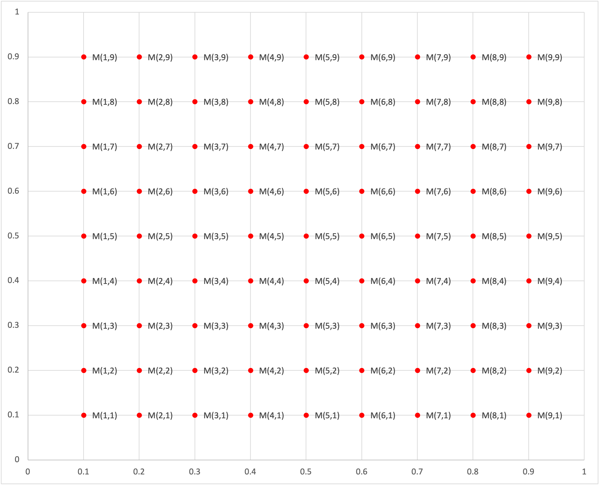

# Methodology

## Metalog Model

Let $X$ be a matrix of predictors and $y$ a vector of outcomes. Each row in $X$ represents one point in time for a particular stock and each column a predictor for the corresponding outcome in $y$. Each value in $y$ represents the stocks performance following the time in $X$.

Example $X$ and $y$:

|                         | 30 Day Volatility | MACD      | Yesterday's Change | Tomorrow's Change   |
| ----------------------- | ----------------- | --------- | ------------------ | ----- |
| AAPL: January 3rd, 2020 | $X_{1,1}$         | $X_{1,2}$ | $X_{1,3}$          | $y_1$ |
| AAPL: January 6th, 2020 | $X_{2,1}$         | $X_{2,2}$ | $X_{2,3}$          | $y_2$ |
| AAPL: January 7th, 2020 | $X_{3,1}$         | $X_{3,2}$ | $X_{3,3}$          | $y_3$ |
| MSFT: January 3rd, 2020 | $X_{4,1}$         | $X_{4,2}$ | $X_{4,3}$          | $y_4$ |
| MSFT: January 6th, 2020 | $X_{5,1}$         | $X_{5,2}$ | $X_{5,3}$          | $y_5$ |
| MSFT: January 7th, 2020 | $X_{6,1}$         | $X_{6,2}$ | $X_{6,3}$          | $y_6$ |

For this project, we are less interested in predicting the $y$ values with accuracy, and more interested in modelling their distribution to gain insights into volatility and risk.

To model the distribution of a $y_i$ given a row $X_i$, we can use a $K$-nearest neighbors model and fit the $K$ neighbors to a [metalog distribution](https://en.wikipedia.org/wiki/Metalog_distribution) $M_i$. However, applying KNN every time we estimate a $y_i$ distribution is slow and inefficent. Rather, we will create a discrete mapping from $X_i\rightarrow M_i$.

Consider the mapping below where the x and y axis represent the two columns of $X$ in the case that $X$ has only two columns. Now consider $M(1,2)$. This represents a metalog distribution fitted to the $K$ neighbors of $[x=0.1\ y=0.2]$. With this mapping, instead of calculating a new $K$ nearest neighbors for each new row of $X$, we can lookup the metalog in the mapping that is closest to the new row of $X$.

The above represents a mapping for an $X$ that has only two columns. However, $X$ may have more than two columns in which case the number of discrete points in the mapping exponentially grows. To control this, we perform PCA on $X$ to reduce its dimensionality to two.

$$
M_{(x_1,\ x_2)} = M_{(Xv_1,\ Xv_2)}
$$

## Stock Correlation

To account for corrleation between stocks, we compute the correlation matrix $S$ using historical log price changes for each stock.

## Sampling

Sample from the multivate normal distribution.

$$
Y\sim MultiNorm(\mu=\vec{0},\ \Sigma=S)
$$

Apply the univariate normal CDF, element-wise, to $Y$ to get a percentile vector.

$$
Z=NormCDF(Y)
$$

For any stock $i$ associated with $X_i$, a random sample is $M_{(x_{i,1},\ x_{i,2})}(Z_i)$.

